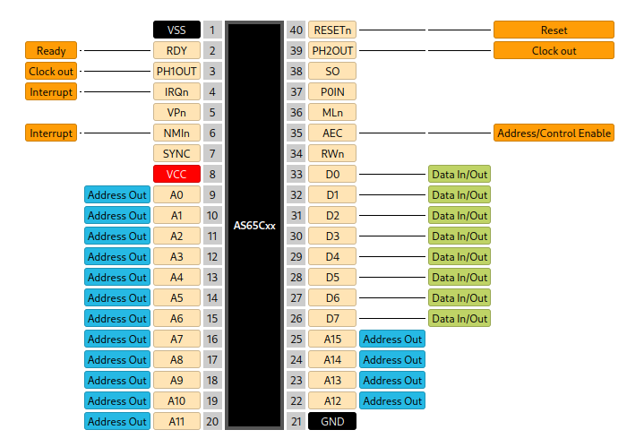
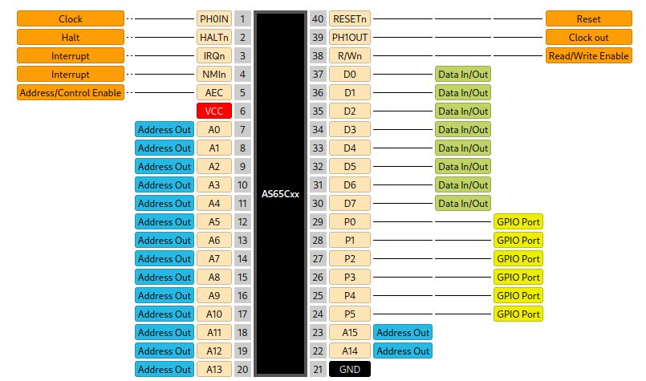

.. _as65cxx:

AS65C02/AS65C10
===============

This design is a fully compatible reimplementation of the MOS 6502 CPU core with 6502 or 6510 pinout options, intended to be a drop-in replacement. All instructions from the original are implemented, including all the undocumented opcodes except JAM/KIL, and execute in a cycle-accurate manner. No bugs from the original were fixed either (i.e. behavior on indirect jumps referencing a page border address), providing 100% compatibility with existing systems. Digital input levels are TTL-compatible, but the CPU is implemented in CMOS, providing a maximum clock rate of up to 33MHz.

Two pad-out configurations are available. Project ID ``'b11100`` selects the AS65C10 with 6510-compatible pad-out, including the 6-bit GPIO port, while ``'b11101`` selects the AS65C02 with 6502-compatible pad-out.

The only major change is that some of the JAM/KIL opcodes were re-purposed to implement actual instructions, providing hardware multiplication support and debugging utilities for the chip designers. To make it possible for software to identify if it is running on a AS65Cxx processor as opposed to a original MOS part, the behavior of one of the undocumented ``NOP #`` instructions was changed to set the ``V`` status bit for a specific immediate value, behavior which is unique to the AS65Cxx parts. This functionality and that of the new instructions are described further below.

Multiple pads on the die are allocated to provide some configuration options. Due to the fact that there are some behavior differences between existing pin-compatible 6502 models and some ambiguity exists on the exact behavior of the MOS 6502 in certain cases, the AS65Cxx may be configured to behave differently in certain scenarios by hard-wiring select configuration pads low, enabling or disabling them. Outside of prototyping, this should be done during wire-bonding after the correct settings for a target product have been determined.

Special note: this design is clocked on the **falling edge** of the input clock signal.

---------------
Pad Assignments
---------------

.. list-table:: Pad description (6502-compatible)
    :name: cxx-6502-pad-description
    :header-rows: 1

    * - Pad
      - Name
      - Type
      - Summary
    * - ``bidir[0]``
      - ``AEC``
      - I (PU)
      - When low, forcefully tri-states the address and data buses as well as the ``R/Wn`` control signal (this does not pause the processor)
    * - ``bidir[1]``
      - ``MLn``
      - O
      - Indicates that a read-modify-write cycle is in progress
    * - ``bidir[2]``
      - Disable write pauses
      - I (PU)
      - Changes the behavior of the ``RDY`` input. When high, ``RDY`` can no longer extend memory writes, only reads, as in the original 6502/6510 processors
    * - ``bidir[3]``
      - Half write cycle
      - I (PU)
      - When high, the data bus is only an output for half a clock period on write cycles, instead of a full clock period, as in the original 6502/6510 processors
    * - ``bidir[4]``
      - ``NC``
      - NC
      - No connect. Bond/wire to ground.
    * - ``bidir[5]``
      - ``SOb``
      - I (PU)
      - A low level on this input sets the ``V`` flag in the status register
    * - ``bidir[6]``
      - ``PH2OUT``
      - O
      - Phi2 clock output (inverse of input clock)
    * - ``bidir[7]``
      - ``RESn``
      - I
      - Active-low reset input
    * - ``bidir[8]``
      - ``RDY``
      - I
      - Input that, while low, pauses the processor during a memory access, forcing it to wait for slower memory
    * - ``bidir[9]``
      - ``PH1OUT``
      - O
      - Phi1 clock output
    * - ``bidir[10]``
      - ``IRQn``
      - I
      - Low-level-sensitive external interrupt input
    * - ``bidir[11]``
      - ``VPn``
      - O
      - Output that goes low while the CPU is fetching an interrupt or reset vector
    * - ``bidir[12]``
      - ``NMIn``
      - I
      - Non-maskable interrupt trigger, falling-edge triggered
    * - ``bidir[13]``
      - ``SYNC``
      - O
      - Status output indicating that the current bus cycle is an instruction fetch in-progress
    * - ``bidir[14]``
      - Sync IRQs
      - I (PU)
      - If high, the ``IRQn`` and ``NMIn`` inputs are additionally buffered through a latch and synchronized to the falling edge of the clock
    * - ``bidir[26:15]``
      - ``A[11:0]``
      - O
      - Address bus outputs, multiplexed in extended bus mode
    * - ``bidir[27]``
      - Sync ``RDY``
      - I (PU)
      - If high, the ``RDY`` input is additionally buffered through a latch and synchronized to the **rising edge** of the clock
    * - ``bidir[28]``
      - ``A[12]``
      - O
      - Part of the address bus outputs
    * - ``bidir[29]``
      - ``II``
      - O
      - Mirrors the state of the ``I`` processor status bit (for debugging use)
    * - ``bidir[32:30]``
      - ``A[15:13]``
      - O
      - Part of the address bus outputs
    * - ``bidir[40:33]``
      - ``D[0:7]``
      - IO
      - Bi-directional data bus (note reversed bit order compared to pad numbering)
    * - ``bidir[41]``
      - ``R/Wn``
      - O
      - Indicates if the current bus cycle is a read (high) or a write (low)

.. list-table:: Pad description (6510-compatible)
    :name: cxx-6510-pad-description
    :header-rows: 1

    * - Pad
      - Name
      - Type
      - Summary
    * - ``bidir[0]``
      - ``D[1]``
      - IO
      - Bi-directional data bus
    * - ``bidir[1]``
      - ``D[0]``
      - IO
      - Bi-directional data bus
    * - ``bidir[2]``
      - ``R/Wn``
      - O
      - Indicates if the current bus cycle is a read (high) or a write (low)
    * - ``bidir[3]``
      - ``PH1OUT``
      - O
      - Phi1 clock output
    * - ``bidir[4]``
      - ``RESn``
      - I
      - Active-low reset input
    * - ``bidir[5]``
      - Half write cycle
      - I (PU)
      - When high, the data bus is only an output for half a clock period on write cycles, instead of a full clock period, as in the original 6502/6510 processors
    * - ``bidir[6]``
      - ``C64SEL``
      - I
      - When high, the directions of the GPIO port bits are initialized, on reset, to what is required on the Commodore 64 - otherwise, they are cleared to zero (all inputs)
    * - ``bidir[7]``
      - Disable write pauses
      - I (PU)
      - Changes the behavior of the ``RDY`` input. When high, ``RDY`` can no longer extend memory writes, only reads, as in the original 6502/6510 processors
    * - ``bidir[8]``
      - Sync IRQs
      - I (PU)
      - If high, the ``IRQn`` and ``NMIn`` inputs are additionally buffered through a latch and synchronized to the falling edge of the clock
    * - ``bidir[9]``
      - ``RDY``
      - I (PU)
      - Input that, while low, pauses the processor during a memory access, forcing it to wait for slower memory
    * - ``bidir[10]``
      - ``IRQn``
      - I
      - Low-level-sensitive external interrupt input
    * - ``bidir[11]``
      - ``NMIn``
      - I
      - Non-maskable interrupt trigger, falling-edge triggered
    * - ``bidir[12]``
      - ``AEC``
      - I (PU)
      - When low, forcefully tri-states the address and data buses as well as the ``R/Wn`` control signal (this does not pause the processor)
    * - ``bidir[26:13]``
      - ``A[13:0]``
      - O
      - Address bus outputs, multiplexed in extended bus mode
    * - ``bidir[27]``
      - Sync ``RDY``
      - I (PU)
      - If high, the ``RDY`` input is additionally buffered through a latch and synchronized to the clock
    * - ``bidir[29:28]``
      - ``A[15:14]``
      - O
      - Part of the address bus outputs
    * - ``bidir[35:30]``
      - ``P[0:5]``
      - IO
      - General-purpose GPIO port
    * - ``bidir[41:36]``
      - ``D[2:7]``
      - IO
      - Bi-directional data bus

----------------
Intended Pinouts
----------------

The pad-out of this design was carefully selected to allow bonding to DIP-40-compatible COB PCBs or DIP-40 ceramic carriers. The intended pinouts are shown below. Just how the project selection pins are intended to be selectively bonded to the ground plane inside the package, the various configuration pins (such as ``bidir[27]`` on either pad-out option) are also pulled high by default and may be bonded to ground selectively.

DIP-40 Pinout for 6502 pad-out
------------------------------

Note here that all three "NC" pins of the original MOS 6502 have been assigned a function. These can be ignored. ``AEC`` contains a built-in pull-up resistor and ``MLn`` and ``VPn`` are outputs.

DIP-40 Pinout for 6510 pad-out
------------------------------

--------------------
"Detect" Instruction
--------------------

To allow software to detect if it is running on AS65Cxx silicon, the so called "detect" instruction may be used. This consists of the bytecode ``E2 42``. This is interpreted as ``NOP #$42`` by both the AS65Cxx and MOS 6502 parts. However, only on the AS65Cxx does this sequence have the side effect of setting the ``V`` flag. The sequence must be specific. Different values for the immediate argument or the opcode do not trigger this setting of the ``V`` flag.

-----------------------
Additional Instructions
-----------------------

The KIL/JAM opcodes of the original MOS 6502 have been re-purposed to add new behavior to the processor. Some are intended for use by the chip developers, but some provide useful new functionality, like hardware multiplication. All KIL/JAM opcodes which have not been repurposed will function as single-byte no-ops.

All of the following instructions are one-byte instructions taking 2 clock cycles to execute (including ``MUL``).

SEV - Set V
-----------

Opcode: ``'h12``

Sets the ``V`` flag. Does not affect other flags.

MUL - Multiply
--------------

Opcode: ``'hB2``

Multiplies the contents of the ``A`` and ``Y`` registers, storing the full 16-bit result in ``A`` (LSBs) and ``Y`` (MSBs). The ``Z`` flag is set if ``A`` **and** ``Y`` are zero after the operation. The ``N`` flag is set if the most-significant bit of ``Y`` is set after the operation.

CHRP - Chirp
------------

Opcode: ``'h02``

Load debug value into ``A``. Does not affect flags.

COR - Corrupt
-------------

Opcode: ``'hF2``

Corrupts the system state by loading ``A``, ``X``, ``Y``, ``SP`` and ``P`` with random values from a LFSR PRNG. All but one of the LFSR bits are left unitinialized on reset, leaving their flip-flops to settle into truly random states on power-up, meaning the random number sequence is different after each power-up.

EXTEND - Reserved
-----------------

Opcode: ``'h92``

Reserved opcode. Currently a no-op, but reserved as an instruction prefix to add up to 256 additional instructions in the future.
