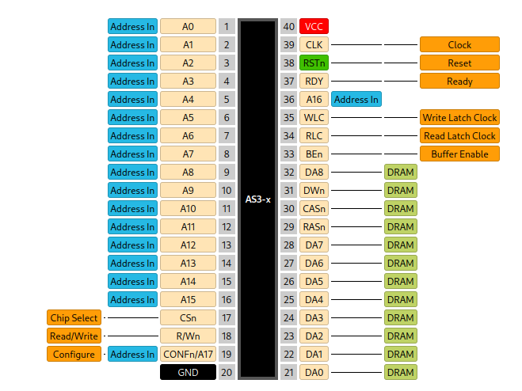
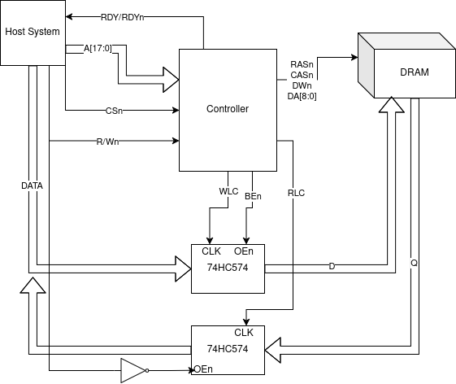

.. _dramcontroller:

DRAM Controller
===============

This design is a controller for retro DRAM chips that automatically generates RAS and CAS timings as well as regular refresh cycles, simplifying system design. Only two standard 74-series support ICs are required for normal function. The easiest use case is to control 64K DRAMs, but 128K and 256K DRAMs may also be controlled.

The controller is entirely agnostic to the word length of the system, but requires an address space of at least 256 addresses (8-bits) on the side of the host system for configuration purposes. The host system must also support waiting for memory controller operations to complete, as indicated by the ``RDY/RDYn`` output.

The input clock to the controller must not necesarily be the same as that of the host system and it is infact recommended to use 2 or 4 times the host system clock, if possible. The only restriction is that ``CSn``, ``R/Wn`` and ``CONFn`` must be synchronous to the input clock. A PLL (i.e. ICS501) is thus recommended for multiplying the host system’s clock to generate the controller’s clock input.

The typical input clock rate is 33MHz, but any clock rate below this, down to zero is possible as this is a fully static CMOS design.

---------------
Pad Assignments
---------------

.. list-table:: Pad description
    :name: dram-controller-pad-description
    :header-rows: 1

    * - Pad
      - Name
      - Type
      - Summary
    * - ``bidir[0]``
      - ``A[16]``
      - I (PD)
      - Host address bus input
    * - ``bidir[1]``
      - ``RDY/RDYn``
      - O
      - Controller Ready output
    * - ``bidir[2]``
      - ``RSTn``
      - I
      - Active-low design reset
    * - ``bidir[3]``
      - ``A[17]``
      - I (PD)
      - Host address bus input
    * - ``bidir[4]``
      - ``CA17``
      - O
      - (Debug) Output mirroring the ``CA17`` setting
    * - ``bidir[5]``
      - ``PE``
      - O
      - (Debug) Output mirroring the ``PE`` setting
    * - ``bidir[6]``
      - "Needs Refresh"
      - O
      - (Debug) Output that is high when a refresh cycle is pending, but has not yet begun
    * - ``bidir[22:7]``
      - ``A[15:0]``
      - I
      - Host address bus inputs
    * - ``bidir[23]``
      - ``CSn``
      - I (PU)
      - Chip Select input
    * - ``bidir[24]``
      - ``R/Wn``
      - I (PU)
      - Read/Write select input
    * - ``bidir[25]``
      - ``CONFn/A17``
      - I (PU)
      - Configure select input or host address bus input
    * - ``bidir[27:26]``
      - ``DA[1:0]``
      - O
      - DRAM Address outputs
    * - ``bidir[28]``
      - ``TEST``
      - O
      - (Debug) Test output
    * - ``bidir[34:29]``
      - ``DA[7:2]``
      - O
      - DRAM Address outputs
    * - ``bidir[35]``
      - ``RASn``
      - O
      - DRAM Row Address Strobe output
    * - ``bidir[36]``
      - ``CASn``
      - O
      - DRAM Column Address Strobe output
    * - ``bidir[37]``
      - ``DWn``
      - O
      - DRAM Write Enable output
    * - ``bidir[38]``
      - ``DA[8]``
      - O
      - DRAM Address output
    * - ``bidir[39]``
      - ``BEn``
      - O
      - Data Buffer Enable output
    * - ``bidir[40]``
      - ``RLC``
      - O
      - Read Latch Clock output
    * - ``bidir[41]``
      - ``WLC``
      - O
      - Write Latch Clock output

---------------
Intended Pinout
---------------

The pad-out of this design was carefully selected to allow bonding to DIP-40-compatible COB PCBs or DIP-40 ceramic carriers. The intended pinout is shown below.

-------------
Configuration
-------------

After reset, the controller first needs to be configured by loading 11 configuration registers. Pulsing ``CSn`` and ``CONFn`` low at the same time will load these registers sequentially. An internal pointer to these registers is maintained by the DRAM controller and incremented after each use of ``CONFn``, which wraps back to zero after the last register is loaded. All memory requests will be ignored until all configuration registers have been loaded at least once.

Each register is 8-bits wide, but due to the lack of a databus connection to the host system, the ``A[7:0]`` address lines are used as the source of data to be copied into the current configuration register. Configuration is thus done by accessing specific memory addresses with ``CONFn`` low, with the least significant 8-bits of the address value into the controller being copied into one of the configuration registers.

The configuration registers, in order, are as follows:

.. wavedrom::

     { "reg": [
       {"name": "refresh_interval[7:0]", "bits": 8}],
       "config": {"hspace": 600}
     }

.. wavedrom::

     { "reg": [
       {"name": "refresh_interval[15:8]", "bits": 8}],
       "config": {"hspace": 600}
     }

This pair or registers sets up rate at which DRAM refresh cycles occur. A refresh cycle is marked as pending every ``refresh_interval + 1`` clock cycles. Note that if this coincides with an ongoing memory access, the controller will finish this access before beginning the refresh cycle.

.. wavedrom::

     { "reg": [
       {"name": "column_bits[3:0]", "bits": 4},{"name": "rdy_polarity", "bits": 1},{"name": "page_mode_en", "bits": 1},{"name": "do_data_setup", "bits": 1},{"name": "delay_rdy", "bits": 1}],
       "config": {"hspace": 900}
     }

This register contains various configuration options.

``column_bits`` contains how many of the DRAM address bits are used for the column address minus one. The minimum value is zero (1 column address bit) and the maximum value is 8 (9 column address bits).

``rdy_polarity`` controls the polarity of the ``RDY/RDYn`` pin. If zero, ``RDY/RDYn`` is active high, if one, ``RDY/RDYn`` is active low. The default after reset until this configuration register bit is programmed is active high.

``page_mode_en`` determines if the controller should keep ``RASn`` asserted and the current row selected for as long as possible following a memory access. This can save time on subsequent accesses to the same row, but not all memory chips support this. A memory access to a different row or a refresh cycle are causes to de-select the current row and select a new one.

``do_data_setup`` may be set to deal with particularly long data setup times on the DRAM. If set, the controller will wait ``delay_setup + 1`` clock cycles after asserting ``BEn`` before continuing.

If ``delay_rdy`` is set, the assertion of ``RDY/RDYn`` is delayed by one clock cycle if ``page_mode_en`` is set, and delayed by ``delay_ras_precharge + 2`` clock cycles if ``page_mode_en`` is clear. This is intended to be set when ``page_mode_en`` is clear.

.. wavedrom::

     { "reg": [
       {"name": "delay_setup[7:0]", "bits": 8}],
       "config": {"hspace": 600}
     }

Data setup delay to DRAM if ``do_data_setup`` is set, don’t care otherwise.

.. wavedrom::

     { "reg": [
       {"name": "delay_hold[7:0]", "bits": 8}],
       "config": {"hspace": 600}
     }

Unused, don’t care.

.. wavedrom::

     { "reg": [
       {"name": "delay_ras[7:0]", "bits": 8}],
       "config": {"hspace": 600}
     }

Delay after falling ``RASn`` edge during refresh cycles. The controller will wait ``delay_ras + 1`` clock cycles after asserting ``RASn`` when beginning a refresh cycle.

.. wavedrom::

     { "reg": [
       {"name": "delay_cas[7:0]", "bits": 8}],
       "config": {"hspace": 600}
     }

Delay after falling ``CASn`` edge during memory access cycles. The controller will wait ``delay_cas + 1`` clock cycles after asserting ``CASn`` during a memory access before continuing.

.. wavedrom::

     { "reg": [
       {"name": "delay_ras_to_cas[7:0]", "bits": 8}],
       "config": {"hspace": 600}
     }

Delay after falling ``RASn`` edge to assertion of ``CASn`` during memory access cycles. The controller will wait ``delay_ras_to_cas + 1`` clock cycles after asserting ``RASn`` during a memory access.

.. wavedrom::

     { "reg": [
       {"name": "delay_ras_precharge[7:0]", "bits": 8}],
       "config": {"hspace": 600}
     }

Delay after rising ``RASn`` edge to allow for precharge to complete. The controller will wait ``delay_ras_precharge + 1`` clock cycles after deasserting ``RASn``, either in a refresh cycle or memory access.

.. wavedrom::

     { "reg": [
       {"name": "delay_cas_precharge[7:0]", "bits": 8}],
       "config": {"hspace": 600}
     }

Delay after rising ``CASn`` edge to allow for precharge to complete. The controller will wait ``delay_cas_precharge + 1`` clock cycles after deasserting ``CASn`` during a memory access.

.. wavedrom::

     { "reg": [
       {"name": "configure_enabled", "bits": 1},{"name": "conf_is_a17", "bits": 1},{"type": 1, "bits": 5},{"name": "pause_on_refresh", "bits": 1}],
       "config": {"hspace": 900}
     }

This register contains additional configuration options.

``configure_enabled`` determines if the ``CONFn`` pin should be disabled. If it is cleared, the controller will stop responding to the ``CONFn`` input until a full reset occurs, allowing simple system setups where ``CONFn`` and ``R/Wn`` are shorted together.¹

¹Errata: Broken. Do not set this bit to zero.

``conf_is_a17`` allows the ``CONFn`` pin to be used as the ``A17`` host address bus pin to address 256K DRAMs on DIP-40 packaged parts. ``configure_enabled`` must be set to zero for ``conf_is_a17`` to take effect, but if this is the case, ``A17`` is remapped from its usual pad to that of the former ``CONFn``.²

²Errata: Broken. Also do not set this to one.

If ``pause_on_refresh`` is set, ``RDY/RDYn`` is deasserted during all refresh cycles, even if no memory request was made by the host system.

----------------------
Memory access function
----------------------

To function properly, two support ICs are required, both of which are standard 74HC(T)574s. These form the write and read buffers respectively, buffering the data lines between the host system bus and the DRAM data buses. The simplest possible setup for this is shown below:

Whenever the controller detects a falling edge on the ``CSn`` pin (while ``CONFn`` is high) and is not already serving a memory request, it begins either a memory read or write depending on the state of ``R/Wn``. If a refresh cycle is currently in progress, it is completed first before the memory request is served. In any case, ``RDY/RDYn`` is deasserted immediately. The controller then performs the necessary row and column address strobes to either write a word of data from the buffers to the DRAM or read a word of data from the DRAM to the buffers. As soon as this is complete, ``RDY/RDYn`` is asserted, signaling to the host system that the memory request has completed.

In the case of a read, the read word is held in the read latch indefinitely, allowing the host system to retrieve it at any arbitrary time after the read has completed. In the case of a write, the word to be written is latched, triggered by a pulse on the ``WLC`` pin, which occurs on the same clock cycle as ``RDY/RDYn`` being deasserted. After this, the host system bus is free to be used for other purposes in the meantime.

