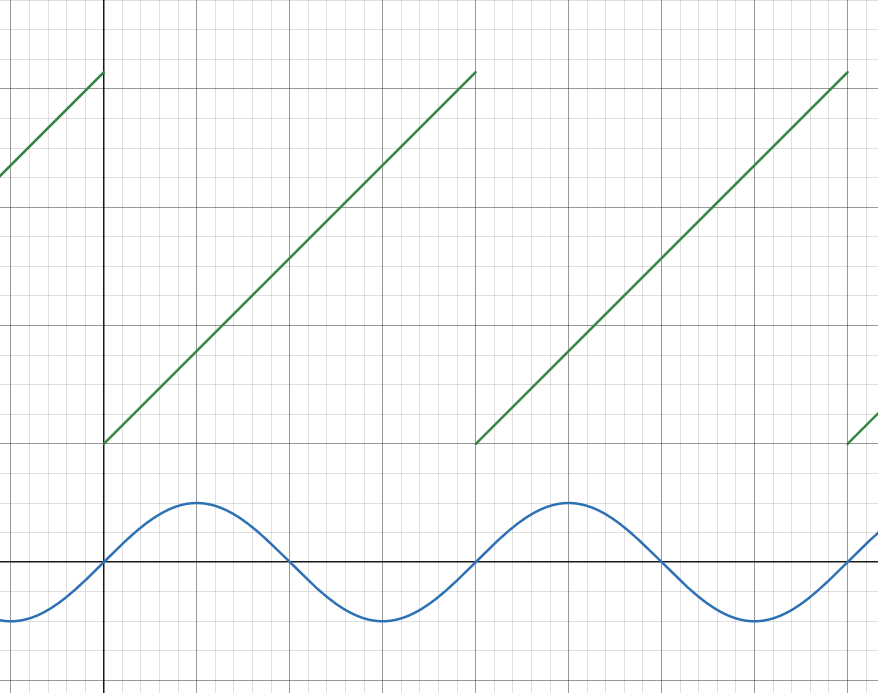
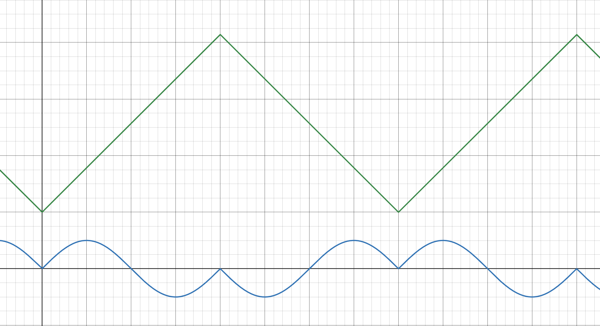
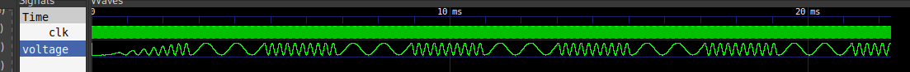

.. _fm:

SID 2 (SID-compatible FM-Synthesizer)
=====================================

The SID 2 is a sound generator that is backwards-compatible with the famous Commodore SID, but extends it by powerful FM Synthesis features. Each of the three voices in the SID 2 consists of two operators, with each operator functioning identially to one SID voice with the addition of a sine-wave output option. In the default, additive synthesis mode, the two operators function independently, with both of their outputs audible, yielding up to 6 total voices nearly analogous to a dual-SID setup. If frequency-modulated synthesis mode is selected for a voice, its two operators are merged, with the output of one (the modulator) shifting the frequency of the other (the modulated). Only the output of the modulated operator becomes audible in this case.

The famous SID filters are also still present in this design, allowing further flexibility in sound generation. Each of the three voices can be independently selected to be passed through this filter. In additive synthesis mode, both operators’ outputs of a selected voice are passed through the filter.

All additional functionality is hidden in new registers mapped to addresses unused in the original SID, which all reset to inactive states, providing backwards-compatibility. Tunes composed for the original SID will also play back correctly on the SID 2.

---------------
Pad Assignments
---------------

.. list-table:: Pad description
    :name: sid-2-pad-description
    :header-rows: 1
    
    * - Pad
      - Name
      - Type
      - Summary
    * - ``bidir[5]``
      - ``R/Wn``
      - I
      - Active low write-enable
    * - ``bidir[10]``
      - ``CEn``
      - I
      - Active low chip-enable
    * - ``bidir[15:11]``
      - ``A[4:0]``
      - I
      - Register address inputs
    * - ``bidir[21:16]``
      - ``D[5:0]``
      - IO
      - Bi-directional databus
    * - ``bidir[23]``
      - ``D[6]``
      - IO
      - Bi-directional databus
    * - ``bidir[32]``
      - ``D[7]``
      - IO
      - Bi-directional databus
    * - ``bidir[33]``
      - ``POTY``
      - IO
      - Potentiometer analog input Y
    * - ``bidir[34]``
      - ``POTX``
      - IO
      - Potentiometer analog input X
    * - ``bidir[39]``
      - ``A[5]``
      - I (PD)
      - Register address input
    * - ``bidir[41]``
      - ``RSTn``
      - I
      - Active-low design reset

---------
Registers
---------

To allow for twice as many operators to be present on the SID 2 as on the SID, the amount of registers has been doubled through the use of an additional address input to differentiate between the two banks of SID registers. This behaves similarly to a dual-SID setup. The following registers are implemented, with register bits unique to the SID 2 highlighted in green.

Bank 0
------

.. raw:: html

    <table class="regbox">
    <tbody>
        <tr>
            <th></th>
            <th></th>
            <th></th>
            <th></th>
            <th></th>
            <th></th>
            <th></th>
            <th></th>
            <th></th>
        </tr>
        <tr>
            <td style="width: 12.5%;">Addr</td>
            <td style="width: 12.5%;">2⁷</td>
            <td style="width: 12.5%;"></td>
            <td style="width: 12.5%;"></td>
            <td style="width: 12.5%;"></td>
            <td style="width: 12.5%;"></td>
            <td style="width: 12.5%;"></td>
            <td style="width: 12.5%;"></td>
            <td style="width: 12.5%;">2⁰</td>
        </tr>
        <tr><td></td><td colspan="8"><b>Voice 1, Modulating Operator</b></td></tr>
        <tr><td><code>'h00</code></td><td colspan="8">freq[7:0]</td></tr>
        <tr><td><code>'h01</code></td><td colspan="8">freq[15:8]</td></tr>
        <tr><td><code>'h02</code></td><td colspan="8">pw[7:0]</td></tr>
        <tr><td><code>'h03</code></td><td colspan="4" class="regbox-type1"></td><td colspan="4">pw[11:8]</td></tr>
        <tr><td><code>'h04</code></td><td>Noise</td><td>Pulse</td><td>Saw</td><td>Triangle</td><td>Test</td><td>Ring</td><td>Sync</td><td>Gate</td></tr>
        <tr><td><code>'h05</code></td><td colspan="4">attack</td><td colspan="4">decay</td></tr>
        <tr><td><code>'h06</code></td><td colspan="4">sustain</td><td colspan="4">release</td></tr>
        <tr><td></td><td colspan="8"><b>Voice 2, Modulating Operator</b></td></tr>
        <tr><td><code>'h07</code></td><td colspan="8">freq[7:0]</td></tr>
        <tr><td><code>'h08</code></td><td colspan="8">freq[15:8]</td></tr>
        <tr><td><code>'h09</code></td><td colspan="8">pw[7:0]</td></tr>
        <tr><td><code>'h0A</code></td><td colspan="4" class="regbox-type1"></td><td colspan="4">pw[11:8]</td></tr>
        <tr><td><code>'h0B</code></td><td>Noise</td><td>Pulse</td><td>Saw</td><td>Triangle</td><td>Test</td><td>Ring</td><td>Sync</td><td>Gate</td></tr>
        <tr><td><code>'h0C</code></td><td colspan="4">attack</td><td colspan="4">decay</td></tr>
        <tr><td><code>'h0D</code></td><td colspan="4">sustain</td><td colspan="4">release</td></tr>
        <tr><td></td><td colspan="8"><b>Voice 3, Modulating Operator</b></td></tr>
        <tr><td><code>'h0E</code></td><td colspan="8">freq[7:0]</td></tr>
        <tr><td><code>'h0F</code></td><td colspan="8">freq[15:8]</td></tr>
        <tr><td><code>'h10</code></td><td colspan="8">pw[7:0]</td></tr>
        <tr><td><code>'h11</code></td><td colspan="4" class="regbox-type1"></td><td colspan="4">pw[11:8]</td></tr>
        <tr><td><code>'h12</code></td><td>Noise</td><td>Pulse</td><td>Saw</td><td>Triangle</td><td>Test</td><td>Ring</td><td>Sync</td><td>Gate</td></tr>
        <tr><td><code>'h13</code></td><td colspan="4">attack</td><td colspan="4">decay</td></tr>
        <tr><td><code>'h14</code></td><td colspan="4">sustain</td><td colspan="4">release</td></tr>
        <tr><td></td><td colspan="8"><b>Filter Configuration</b></td></tr>
        <tr><td><code>'h15</code></td><td colspan="5" class="regbox-type1"></td><td colspan="3">fc[2:0]</td></tr>
        <tr><td><code>'h16</code></td><td colspan="8">fc[10:3]</td></tr>
        <tr><td><code>'h17</code></td><td colspan="4">res</td><td class="regbox-type1"></td><td>V3</td><td>V2</td><td>V1</td></tr>
        <tr><td><code>'h18</code></td><td>3 OFF</td><td>HP</td><td>BP</td><td>LP</td><td colspan="4">vol</td></tr>
        <tr><td></td><td colspan="8"><b>Misc.</b></td></tr>
        <tr><td><code>'h19</code></td><td colspan="8">potx</td></tr>
        <tr><td><code>'h1A</code></td><td colspan="8">poty</td></tr>
        <tr><td><code>'h1B</code></td><td colspan="8">osc3¹</td></tr>
        <tr><td><code>'h1C</code></td><td colspan="8">env3¹</td></tr>
        <tr><td></td><td colspan="8"><b>Voice 1, Modulating Operator, Sine Configuration</b></td></tr>
        <tr><td><code>'h1D</code></td><td colspan="3" class="regbox-type1"></td><td class="regbox-type2">SNoise</td><td class="regbox-type2">SPulse</td><td class="regbox-type2">SSaw</td><td class="regbox-type2">STriangle</td><td class="regbox-type2">Sine</td></tr>
        <tr><td></td><td colspan="8"><b>Voice 2, Modulating Operator, Sine Configuration</b></td></tr>
        <tr><td><code>'h1E</code></td><td colspan="3" class="regbox-type1"></td><td class="regbox-type2">SNoise</td><td class="regbox-type2">SPulse</td><td class="regbox-type2">SSaw</td><td class="regbox-type2">STriangle</td><td class="regbox-type2">Sine</td></tr>
        <tr><td></td><td colspan="8"><b>Voice 3, Modulating Operator, Sine Configuration</b></td></tr>
        <tr><td><code>'h1F</code></td><td colspan="3" class="regbox-type1"></td><td class="regbox-type2">SNoise</td><td class="regbox-type2">SPulse</td><td class="regbox-type2">SSaw</td><td class="regbox-type2">STriangle</td><td class="regbox-type2">Sine</td></tr>
    </tbody>
    </table>

Bank 1
------

.. raw:: html

    <table class="regbox">
    <tbody>
        <tr>
            <th></th>
            <th></th>
            <th></th>
            <th></th>
            <th></th>
            <th></th>
            <th></th>
            <th></th>
            <th></th>
        </tr>
        <tr>
            <td style="width: 12.5%;">Addr</td>
            <td style="width: 12.5%;">2⁷</td>
            <td style="width: 12.5%;"></td>
            <td style="width: 12.5%;"></td>
            <td style="width: 12.5%;"></td>
            <td style="width: 12.5%;"></td>
            <td style="width: 12.5%;"></td>
            <td style="width: 12.5%;"></td>
            <td style="width: 12.5%;">2⁰</td>
        </tr>
        <tr><td></td><td colspan="8"><b>Voice 1, Modulated Operator</b></td></tr>
        <tr><td><code>'h20</code></td><td colspan="8">freq[7:0]</td></tr>
        <tr><td><code>'h21</code></td><td colspan="8">freq[15:8]</td></tr>
        <tr><td><code>'h22</code></td><td colspan="8">pw[7:0]</td></tr>
        <tr><td><code>'h23</code></td><td colspan="4" class="regbox-type1"></td><td colspan="4">pw[11:8]</td></tr>
        <tr><td><code>'h24</code></td><td>Noise</td><td>Pulse</td><td>Saw</td><td>Triangle</td><td>Test</td><td>Ring</td><td>Sync</td><td>Gate</td></tr>
        <tr><td><code>'h25</code></td><td colspan="4">attack</td><td colspan="4">decay</td></tr>
        <tr><td><code>'h26</code></td><td colspan="4">sustain</td><td colspan="4">release</td></tr>
        <tr><td></td><td colspan="8"><b>Voice 2, Modulated Operator</b></td></tr>
        <tr><td><code>'h27</code></td><td colspan="8">freq[7:0]</td></tr>
        <tr><td><code>'h28</code></td><td colspan="8">freq[15:8]</td></tr>
        <tr><td><code>'h29</code></td><td colspan="8">pw[7:0]</td></tr>
        <tr><td><code>'h2A</code></td><td colspan="4" class="regbox-type1"></td><td colspan="4">pw[11:8]</td></tr>
        <tr><td><code>'h2B</code></td><td>Noise</td><td>Pulse</td><td>Saw</td><td>Triangle</td><td>Test</td><td>Ring</td><td>Sync</td><td>Gate</td></tr>
        <tr><td><code>'h2C</code></td><td colspan="4">attack</td><td colspan="4">decay</td></tr>
        <tr><td><code>'h2D</code></td><td colspan="4">sustain</td><td colspan="4">release</td></tr>
        <tr><td></td><td colspan="8"><b>Voice 3, Modulated Operator</b></td></tr>
        <tr><td><code>'h2E</code></td><td colspan="8">freq[7:0]</td></tr>
        <tr><td><code>'h2F</code></td><td colspan="8">freq[15:8]</td></tr>
        <tr><td><code>'h30</code></td><td colspan="8">pw[7:0]</td></tr>
        <tr><td><code>'h31</code></td><td colspan="4" class="regbox-type1"></td><td colspan="4">pw[11:8]</td></tr>
        <tr><td><code>'h32</code></td><td>Noise</td><td>Pulse</td><td>Saw</td><td>Triangle</td><td>Test</td><td>Ring</td><td>Sync</td><td>Gate</td></tr>
        <tr><td><code>'h33</code></td><td colspan="4">attack</td><td colspan="4">decay</td></tr>
        <tr><td><code>'h34</code></td><td colspan="4">sustain</td><td colspan="4">release</td></tr>
        <tr><td></td><td colspan="8"><b>Modulation Volume Adjust</b></td></tr>
        <tr><td><code>'h35</code></td><td colspan="8" class="regbox-type2">modvol1</td></tr>
        <tr><td><code>'h36</code></td><td colspan="8" class="regbox-type2">modvol2</td></tr>
        <tr><td><code>'h37</code></td><td colspan="8" class="regbox-type2">modvol3</td></tr>
        <tr><td></td><td colspan="8"><b>FM Configuration</b></td></tr>
        <tr><td><code>'h38</code></td><td class="regbox-type2">CD</td><td colspan="3" class="regbox-type2">inv</td><td class="regbox-type1"></td><td colspan="3" class="regbox-type2">fm_en</td></tr>
        <tr><td></td><td colspan="8"><b>Misc.</b></td></tr>
        <tr><td><code>'h39</code></td><td colspan="8">potx</td></tr>
        <tr><td><code>'h3A</code></td><td colspan="8">poty</td></tr>
        <tr><td><code>'h3B</code></td><td colspan="8">osc3¹</td></tr>
        <tr><td><code>'h3C</code></td><td colspan="8">env3¹</td></tr>
        <tr><td></td><td colspan="8"><b>Voice 1, Modulated Operator, Sine Configuration</b></td></tr>
        <tr><td><code>'h3D</code></td><td colspan="3" class="regbox-type1"></td><td class="regbox-type2">SNoise</td><td class="regbox-type2">SPulse</td><td class="regbox-type2">SSaw</td><td class="regbox-type2">STriangle</td><td class="regbox-type2">Sine</td></tr>
        <tr><td></td><td colspan="8"><b>Voice 2, Modulated Operator, Sine Configuration</b></td></tr>
        <tr><td><code>'h3E</code></td><td colspan="3" class="regbox-type1"></td><td class="regbox-type2">SNoise</td><td class="regbox-type2">SPulse</td><td class="regbox-type2">SSaw</td><td class="regbox-type2">STriangle</td><td class="regbox-type2">Sine</td></tr>
        <tr><td></td><td colspan="8"><b>Voice 3, Modulated Operator, Sine Configuration</b></td></tr>
        <tr><td><code>'h3F</code></td><td colspan="3" class="regbox-type1"></td><td class="regbox-type2">SNoise</td><td class="regbox-type2">SPulse</td><td class="regbox-type2">SSaw</td><td class="regbox-type2">STriangle</td><td class="regbox-type2">Sine</td></tr>
    </tbody>
    </table>

¹In bank 0, these registers sample from the modulating operator of Voice 3, but in bank 1, they sample from the modulated operator of Voice 3.

----------------------
Functional Description
----------------------

Description of original SID function is not covered in this documentation, please refer to `original documentation <https://www.waitingforfriday.com/?p=661>`__ for information on SID functionality.

Compatibility Mode
------------------

After reset, the SID 2 behaves like a single SID. FM is disabled for all voices, putting them in additive mode. However, the ``CD`` (short for Compatibility Disable) bit of register ``'h38`` gates additive synthesis mode. If this bit is cleared, as is the default, only the three operators of bank 0 (the modulating operators) are audible, with the additional operators of bank 1 being disabled.

Additive Synthesis
------------------

Once ``CD`` is set, additive mode is enabled for all voices that do not have FM enabled. In additive mode, the modulating and modulated operator outputs in the affected voice are added together. To prevent clipping, the volume of each operator is halved before this addition, meaning the final voice output is ``v = op1 * 0.5 + op2 * 0.5``. This incompatibility necessitates the existance of the ``CD`` bit, as the halving does not take place when it is clear. FM can be enabled for individual voices even while ``CD`` is clear.

Frequency Modulation Synthesis
------------------------------

Frequency Modulation Synthesis can be enabled for individual voices by setting the corresponding bit in ``fm_en``. In this mode, the output of the modulating operator of the affected voice becomes inaudible and is instead used to modulate the frequency of the modulated operator. The frequency of the modulated operator is continuously multiplied by one plus the amplitude of the modulating operator output multiplied by three: ``f_mod = freq * (1 + amplitude * 3)``.

To control this effect more precisely, the ``modvol1`` through ``modvol3`` registers scale the output of the corresponding voice’s modulating operator. A value of zero is off, while a value of ``'hFF`` is full volume. In FM Mode, this allows the maximum frequency shift to be tuned. In additive mode, these register simply scale the audible volume of these operators, even if ``CD`` is clear. To maintain backwards-compatibility, all three ``modvol`` registers read ``'hFF`` after reset.

Sine Wave Generation
--------------------
 
To allow for more interesting and dynamic sound types to be generated, all 6 operators on the SID 2 have been extended by one additional waveform type: sine wave. This can be selected by setting the "Sine" bit in the corresponding "Sine Configuration" register, along with at least one of "SNoise", "SPulse", "SSaw" or "STriangle". Selecting multiple waveform types causes the output of the operator to become the bitwise-logic-AND of all selected waveforms, just as on the SID, which now includes the sine wave.

The sine wave is generated by indexing a quarter-sine Look-Up-Table and translating its output depending on which quadrant of the wave the index falls in. How this index is generated depends on the remaining bits in the Sine Configuration register. A normal sine wave can be achieved by setting just the "SSaw" bit. This selects the value of the sawtooth waveform to be used as the LUT index. As this waveform’s binary amplitude simply counts up until overflowing to zero, this results in a linear cycling through the LUT indices and thus a normal sine wave. However, other waveforms, and their bitwise-logic-AND combinations, may be used as  the LUT index, creating other waveforms. For instance, selecting just "STriangle" as the LUT index generates a "mirrored" looking wave.

Relationship between LUT index and sine output. This is also the final output when using sawtooth as the LUT index.

Alternative waveform achievable by using triangle as the LUT index.

Frequency modulation example where the modulating operator is playing a square wave and the modulated operator is playing a sine wave.
