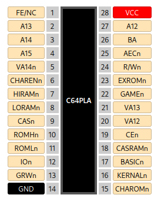

.. _pla:

Commodore 64 PLA
================

This design is a replica of the PLA chip used in the Commodore 64 home computer, but implemented through discrete logic rather than an actual PLA. Implementing this circuit in a way that does not cause timing problems with other chips inside the Commodore 64 requires specific input-to-output propagation delays to be met. As this delay was difficult to estimate for this multi-project die, several different delay lengths are selectable through the ``CASDEL[1:0]`` and ``DEL`` inputs. The former selects a delay specifically for the ``CASRAMn`` output, while the latter selects the delay for all other outputs. All of these inputs have built-in pull-ups, meaning any delay can be selected by hardwiring or bonding specific inputs to ground.

When ``DEL`` is high, it selects additional delay. Otherwise, no additional delay is added.

``CASDEL[1:0]`` features four possible delay settings:

.. list-table:: ``CASDEL[1:0]`` settings
    :name: casdel-description
    :header-rows: 1

    * - ``CASDEL[1:0]`` value
      - Setting
    * - ``'b00``
      - Short delay
    * - ``'b01``
      - Medium delay
    * - ``'b10``
      - No delay
    * - ``'b11``
      - High delay

---------------
Pad Assignments
---------------

PLA Pin descriptions taken from `the C64 wiki <https://www.c64-wiki.com/wiki/PLA_(C64_chip)>`__.

All unused pads should be hardwired or bonded to ground, if possible.

.. list-table:: Pad description
    :name: pla-pad-description
    :header-rows: 1

    * - Pad
      - Name
      - Type
      - Summary
    * - ``bidir[0]``
      - ``R/Wn``
      - I
      - Connected to R/#W of the bus
    * - ``bidir[1]``
      - ``AECn``
      - I
      - #AEC, connected to inverted version of AEC on the VIC-II
    * - ``bidir[2]``
      - ``BA``
      - I
      - Connected to BA on the VIC-II
    * - ``bidir[3]``
      - ``A12``
      - I
      - Connected to A12 of the address bus
    * - ``bidir[7]``
      - ``FE/NC``
      - I
      - Used for programming field-programmable parts and not connected internally for mask programmable parts.
    * - ``bidir[8]``
      - ``A13``
      - I
      - Connected to A13 of the address bus
    * - ``bidir[9]``
      - ``A14``
      - I
      - Connected to A14 of the address bus
    * - ``bidir[10]``
      - ``A15``
      - I
      - Connected to A15 of the address bus
    * - ``bidir[12]``
      - ``VA14n``
      - I
      - Connected to #VA14 on VIC-II
    * - ``bidir[13]``
      - ``CHARENn``
      - I
      - Connected to #CHAREN on I/O port of the 6510 CPU
    * - ``bidir[14]``
      - ``HIRAMn``
      - I
      - Connected to #HIRAM on I/O port of the 6510 CPU
    * - ``bidir[19]``
      - ``LORAMn``
      - I
      - Connected to #LORAM on I/O port of the 6510 CPU
    * - ``bidir[20]``
      - ``CASn``
      - I
      - Connected to #CAS on the VIC-II
    * - ``bidir[21]``
      - ``ROMHn``
      - O
      - #ROMH
    * - ``bidir[22]``
      - ``ROMLn``
      - O
      - #ROML
    * - ``bidir[23]``
      - ``IOn``
      - O
      - #I/O
    * - ``bidir[24]``
      - ``GRWn``
      - O
      - GR/#W, connected to #WE on the color RAM
    * - ``bidir[26]``
      - ``CHAROMn``
      - O
      - Connected to #CS1 on the #CHAROM
    * - ``bidir[27]``
      - ``KERNALn``
      - O
      - Connected to #CS on the #KERNAL ROM
    * - ``bidir[30]``
      - ``BASICn``
      - O
      - Connected to #CS on the #BASIC ROM
    * - ``bidir[31]``
      - ``CASRAMn``
      - O
      - #CASRAM, connected to the #CAS pin on the DRAM
    * - ``bidir[32]``
      - ``CEn``
      - I
      - Chip Enable / Output Enable (active-low)
    * - ``bidir[33]``
      - ``VA12``
      - I
      - Connected to VA12 on VIC-II
    * - ``bidir[35]``
      - ``VA13``
      - I
      - Connected to VA13 on VIC-II
    * - ``bidir[37]``
      - ``DEL``
      - I (PU)
      - Delay select for all outputs except ``CASRAMn``
    * - ``bidir[39:38]``
      - ``CASDEL[1:0]``
      - I (PU)
      - Delay select for the ``CASRAMn`` output
    * - ``bidir[40]``
      - ``GAMEn``
      - I
      - Connected to #GAME on pin 8 of cartridge port
    * - ``bidir[41]``
      - ``EXROMn``
      - I
      - Connected #EXROM on pin 9 of cartridge port

---------------
Intended Pinout
---------------

The pad-out of this design was carefully selected to allow bonding to DIP-28-compatible COB PCBs or DIP-28 ceramic carriers to form a drop-in replacement for the Commodore 64 PLA chip. The intended pinout is shown below.

