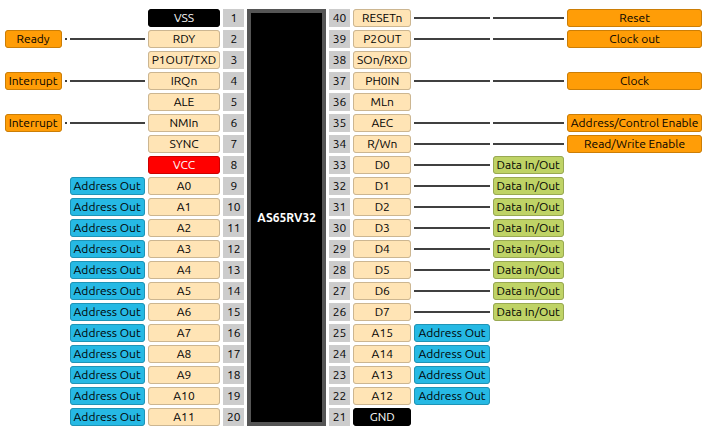
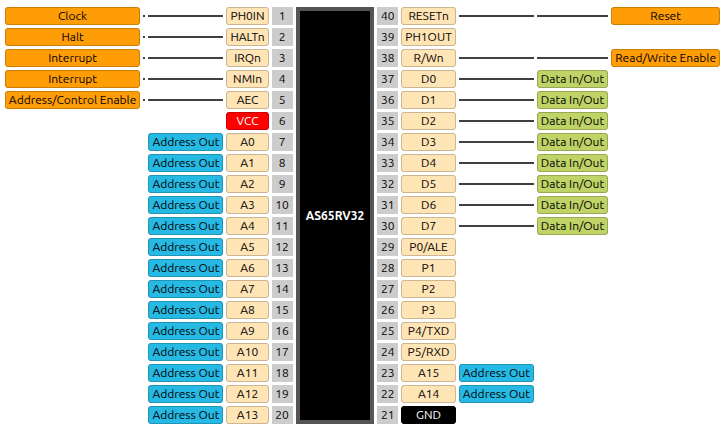

.. _rv32:

AS65RV32
========

The AS65RV32 is a RISC-V, ``rv32ima_zicsr_smrnmi`` processor with some built-in peripherals that is pinout and bus-signaling compatible with either the MOS 6502 or 6510 microprocessors (selectable). It features the same 8-bit databus, but optionally expands the address bus to its full 32-bits. Both NMI and regular interrupt requests function mostly as described in RISC-V specs, but are instead vectored by reading the interrupt handler address from memory in the same way as it is done by the 6502/6510 microprocessors.

Two pad-out configurations are available. Project ID ``'b01000`` selects the AS65RV32 with 6510-compatible pad-out, including the 6-bit GPIO port, while ``'b01001`` selects the AS65RV32 with 6502-compatible pad-out.

Special note: this design is clocked on the **falling edge** of the input clock signal.

---------------
Pad Assignments
---------------

.. list-table:: Pad description (6502-compatible)
    :name: rv32-6502-pad-description
    :header-rows: 1

    * - Pad
      - Name
      - Type
      - Summary
    * - ``bidir[0]``
      - ``AEC``
      - I (PU)
      - When low, forcefully tri-states the address and data buses as well as the ``R/Wn`` control signal (this does not pause the processor)
    * - ``bidir[1]``
      - ``MLn``
      - O
      - Indicates that a read-modify-write cycle is in progress (i.e. atomic instruction)
    * - ``bidir[2]``
      - Disable write pauses
      - I (PU)
      - Changes the behavior of the ``RDY`` input. When high, ``RDY`` can no longer extend memory writes, only reads, as in the original 6502/6510 processors
    * - ``bidir[3]``
      - Half write cycle
      - I (PU)
      - When high, the data bus is only an output for half a clock period on write cycles, instead of a full clock period, as in the original 6502/6510 processors
    * - ``bidir[4]``
      - TXD
      - O
      - Transmit line of the built-in UART
    * - ``bidir[5]``
      - ``SOb``/``RXD``
      - I (PU)
      - A low level on this input sets the ``O`` flag in the ``cpuconf`` CSR if ``uart_reloc`` in the same CSR is clear. If the bit is set, it is the same as ``RXD``
    * - ``bidir[6]``
      - ``PH2OUT``
      - O
      - Phi2 clock output (inverse of input clock)
    * - ``bidir[7]``
      - ``RESn``
      - I
      - Active-low reset input
    * - ``bidir[8]``
      - ``RDY``
      - I
      - Input that, while low, pauses the processor during a memory access, forcing it to wait for slower memory
    * - ``bidir[9]``
      - ``PH1OUT``/``TXD``
      - O
      - Phi1 clock output if the ``uart_reloc`` bit in ``cpuconf`` is clear, same as ``TXD`` if the bit is set
    * - ``bidir[10]``
      - ``IRQn``
      - I
      - Low-level-sensitive external interrupt input
    * - ``bidir[11]``
      - ``ALE``
      - O
      - Address Latch Enable output which pulses high when the high-order address bits are presented on ``A`` in extended bus mode
    * - ``bidir[12]``
      - ``NMIn``
      - I
      - Non-maskable interrupt trigger, falling-edge triggered
    * - ``bidir[13]``
      - ``SYNC``
      - O
      - Status output indicating that the current bus cycle is an instruction fetch in-progress
    * - ``bidir[14]`` ¹
      - ``RXD`` ¹
      - I (PU)
      - Receive line of the built-in UART
    * - ``bidir[26:15]``
      - ``A[11:0]``
      - O
      - Address bus outputs, multiplexed in extended bus mode
    * - ``bidir[27]``
      - Sync ``RDY``
      - I (PU)
      - If high, the ``RDY`` pin is additionally buffered through a latch and synchronized to the **rising edge** of the clock
    * - ``bidir[28]``
      - ``A[12]``
      - O
      - Part of the address bus outputs
    * - ``bidir[29]``
      - No Connect
      - NC
      - Unused
    * - ``bidir[32:30]``
      - ``A[15:13]``
      - O
      - Part of the address bus outputs
    * - ``bidir[40:33]``
      - ``D[0:7]``
      - IO
      - Bi-directional data bus (note reversed bit order compared to pad numbering)
    * - ``bidir[41]``
      - ``R/Wn``
      - O
      - Indicates if the current bus cycle is a read (high) or a write (low)

.. list-table:: Pad description (6510-compatible)
    :name: rv32-6510-pad-description
    :header-rows: 1

    * - Pad
      - Name
      - Type
      - Summary
    * - ``bidir[0]``
      - ``D[1]``
      - IO
      - Bi-directional data bus
    * - ``bidir[1]``
      - ``D[0]``
      - IO
      - Bi-directional data bus
    * - ``bidir[2]``
      - ``R/Wn``
      - O
      - Indicates if the current bus cycle is a read (high) or a write (low)
    * - ``bidir[3]``
      - ``PH1OUT``
      - O
      - Phi1 clock output
    * - ``bidir[4]``
      - ``RESn``
      - I
      - Active-low reset input
    * - ``bidir[5]``
      - Half write cycle
      - I (PU)
      - When high, the data bus is only an output for half a clock period on write cycles, instead of a full clock period, as in the original 6502/6510 processors
    * - ``bidir[6]``
      - TXD
      - O
      - Transmit line of the built-in UART
    * - ``bidir[7]``
      - Disable write pauses
      - I (PU)
      - Changes the behavior of the ``RDY`` input. When high, ``RDY`` can no longer extend memory writes, only reads, as in the original 6502/6510 processors
    * - ``bidir[8]`` ¹
      - ``RXD`` ¹
      - I (PU)
      - Receive line of the built-in UART
    * - ``bidir[9]``
      - ``RDY``
      - I
      - Input that, while low, pauses the processor during a memory access, forcing it to wait for slower memory
    * - ``bidir[10]``
      - ``IRQn``
      - I
      - Low-level-sensitive external interrupt input
    * - ``bidir[11]``
      - ``NMIn``
      - I
      - Non-maskable interrupt trigger, falling-edge triggered
    * - ``bidir[12]``
      - ``AEC``
      - I (PU)
      - When low, forcefully tri-states the address and data buses as well as the ``R/Wn`` control signal (this does not pause the processor)
    * - ``bidir[26:13]``
      - ``A[13:0]``
      - O
      - Address bus outputs, multiplexed in extended bus mode
    * - ``bidir[27]``
      - Sync ``RDY``
      - I (PU)
      - If high, the ``RDY`` input is additionally buffered through a latch and synchronized to the clock
    * - ``bidir[29:28]``
      - ``A[15:14]``
      - O
      - Part of the address bus outputs
    * - ``bidir[30]``
      - ``P[5]``/``RXD``
      - IO (PU)
      - GPIO port bit 5 if ``uart_reloc`` in the ``cpuconf`` CSR is clear. If the bit is set, it is the same as ``RXD``
    * - ``bidir[31]``
      - ``P[4]``/``TXD``
      - IO
      - GPIO port bit 4 if ``uart_reloc`` in the ``cpuconf`` CSR is clear. If the bit is set, it is the same as ``TXD``
    * - ``bidir[34:32]``
      - ``P[1:3]``
      - IO
      - Bits 1 through 3 of the GPIO port
    * - ``bidir[35]``
      - ``P[0]``/``ALE``
      - IO
      - Address Latch Enable output if in extended bus mode, GPIO port bit 0 otherwise
    * - ``bidir[41:36]``
      - ``D[2:7]``
      - IO
      - Bi-directional data bus

¹This pin acts as ``RXD`` after reset. However, while reset is active, on every falling clock edge, its state (high or low) is latched and used as another configuration option: "Sync IRQs". If low upon reset being released, the ``IRQn`` and ``NMIn`` inputs are henceforth internally buffered through latches on every falling clock edge.

----------------
Intended Pinouts
----------------

The pad-out of this design was carefully selected to allow bonding to DIP-40-compatible COB PCBs or DIP-40 ceramic carriers. The intended pinouts are shown below. Just how the project selection pins are intended to be selectively bonded to the ground plane inside the package, the various configuration pins (such as ``bidir[27]`` on either pad-out option) are also pulled high by default and may be bonded to ground selectively.

DIP-40 Pinout for 6502 pad-out
------------------------------

DIP-40 Pinout for 6510 pad-out
------------------------------

-------------
Bus Interface
-------------

Basic Bus Cycle
---------------

.. wavedrom::

    {signal: [
    {name: 'CLK', wave: 'p....', period: 2},
    {name: 'ALE', wave: '010.......'},
    {name: 'R/Wn', wave: '1....0.1..'},
    {name: 'A[15:0]', wave: 'z5.6...6..', data: 'addr[31:16] addr[15:0] addr[15:0]'},
    {name: 'D[7:0]', wave: 'z..6.z75..', data: 'read[7:0] write[7:0] read[15:0]'}
    ],config: { hscale: 2 }}

Effect of "Half write cycle" low
--------------------------------

.. wavedrom::

    {signal: [
    {name: 'CLK', wave: 'p....', period: 2},
    {name: 'ALE', wave: '010.......'},
    {name: 'R/Wn', wave: '1....0.1..'},
    {name: 'A[15:0]', wave: 'z5.6...6..', data: 'addr[31:16] addr[15:0] addr[15:0]'},
    {name: 'D[7:0]', wave: 'z..6.7.5..', data: 'read[7:0] write[7:0] read[15:0]'}
    ],config: { hscale: 2 }}

Successive writes
-----------------

.. wavedrom::

    {signal: [
    {name: 'CLK', wave: 'p.....', period: 2},
    {name: 'ALE', wave: '010.........'},
    {name: 'R/Wn', wave: '1....0...1..'},
    {name: 'A[15:0]', wave: 'z5.6...6.6..', data: 'addr[31:16] addr[15:0] addr[15:0] addr[15:0]'},
    {name: 'D[7:0]', wave: 'z..6.z7z75..', data: 'read[7:0] write[7:0] write[7:0] read[15:0]'}
    ],config: { hscale: 2 }}

The ``R/Wn`` pin remains low for successive writes and does not pulse for each byte. Only address and data change on the falling edge of the clock.

Reset/Vector Fetch Sequence
---------------------------

.. wavedrom::

    {signal: [
    {name: 'CLK', wave: 'n........', period: 2},
    {name: 'RESn', wave: '01................'},
    {name: 'ALE', wave: '0.10..............'},
    {name: 'R/Wn', wave: '1.................'},
    {name: 'A[15:0]', wave: 'z.5.6.6.6.6.x.x.6.', data: '\'hFFFF \'hFFFC \'hFFFD \'hFFFE \'hFFFF PC[15:0]'},
    {name: 'D[7:0]', wave: 'z...7.7.7.7.z...7.', data: 'vec[7:0] vec[15:8] vec[23:16] vec[31:24] instr[7:0]'}
    ],config: { hscale: 2 }}

After reset goes high, the CPU starts up in non-extended bus mode, with only 16-bit addresses. However, to ensure hardware intended for extended bus mode starts up correctly, a single pulse is emitted on ``ALE`` with the address lines set to ``'hFFFF`` to initialize the address latches.
On the 6510-compatible pinout, where all ``P[5:0]`` pins are intended to be in a high-impedance state after reset, this means pin ``P0`` will briefly become an output, emit the pulse, then return to its high-impedance state. A pull-down resistor on this pin is required if it is to be used as ``ALE`` after initialization and a series resistor is required if it is to be used as a general-purpose input in non-extended bus mode.

After this pulse, the processor performs a vector fetch, whereby four successive bytes are fetched starting at address ``'hFFFC`` and then loaded into the Program Counter before beginning program execution. These vector fetch cycles are identical when an interrupt looks up its vector, but using different addresses.

-----------
Peripherals
-----------

GPIO Port
---------

The 6510-compatible pad-out offers a 6-bit GPIO port with individually programmable port directions. It is accessed through the following non-standard CSRs:

``ddr`` - Data Direction Register - ``'hBC0``

.. wavedrom::

     { "reg": [
       {"name": "DDR", "bits": 6}],
       "config": {"hspace": 600}
     }

``port`` - Port Register - ``'hBC1``

.. wavedrom::

     { "reg": [
       {"name": "PORT", "bits": 6}],
       "config": {"hspace": 600}
     }

The bits in ``ddr`` set the direction of the GPIO pins: a one sets that pin to an output while a zero sets that port to a high-impedance input. Writing ``port`` will then set the high or low state of all pins configured as output while reading ``port`` returns a mix of the current output states of the output pins and the current input levels of the input pins.

Note that relocating the UART overrides these settings for port bits 5 and 4, and switching to extended bus mode overrides the setting for port bit 0. Controlling the direction and value of these pins then no longer is possible through these CSRs.

UART
----

Both pad-out variants provide pads for a UART serial port. By default, the receive and transmit lines for this port are allocated to pads which are not otherwise used. However, these pads are not exposed on the DIP-40 pinouts. To allow the UART to be exposed on the DIP-40 pinout without potentially breaking backwards-compatibility with existing pin functions, the UART can be relocated by setting the ``uart_reloc`` bit in the ``cpuconf`` CSR. Doing this switches two pins on the DIP-40 pinout to become the new ``RXD`` and ``TXD``. Note that, if this is done, the UART continues to transmit on both the non-relocated and relocated ``TXD``.

The UART is usable through the following non-standard CSRs:

``ustat/utx`` - UART Status - ``'h139``

.. wavedrom::

     { "reg": [
       {"name": "USTAT / UTX", "bits": 32}],
       "config": {"hspace": 600}
     }

This CSR reads ``'hFFFFFFFF`` if  the UART transmitter is busy and no new characters can be sent right now. Otherwise, if the transmitter is idle, it reads zero.

If written to, the least-significant 8 bits of the written value are captured and sent to the UART transmitter to be serially transmitted on ``TXD``. The transmitter enters the busy state until transmission is complete.

``urx`` - UART Receive - ``'h140``

.. wavedrom::

     { "reg": [
       {"name": "URX", "bits": 32}],
       "config": {"hspace": 600}
     }

If read, this CSR reads the current 8-bit, zero-padded value in the UART receive buffer, if one is available. If the receive buffer is empty, it reads ``'hFFFFFFFF``. Reading this register clears the receive buffer.

``udiv`` - UART Clock Divisor - ``'h142``

.. wavedrom::

     { "reg": [
       {"name": "UDIV", "bits": 16},{"type": 1, "bits": 16}],
       "config": {"hspace": 600}
     }

This CSR defines the amount by which the processor clock is divided to arrive at the UART bitclock. The UART bitclock will be equal to ``CPU clock / (UDIV + 1)``. Upon reset, its value is set to 88, which approximately equals a 115200 bitrate at an input clock of 10MHz.

Interrupt-capable timer
-----------------------

A single 32-bit presetable timer allows for generation of regular interrupts on the processor. The timer will count up from zero until it reaches or exceeds the value defined in ``itimermatch``, at which point it will reset to zero and also generate a regular interrupt if the corresponding interrupt enable is set.

The timer value can be read out and set at any time by accessing its CSR. As such, it is also possible to use it as a general-purpose timer under software control.

The following non-standard CSRs control timer operation:

``itimer`` - Timer value - ``'hBC3``

.. wavedrom::

     { "reg": [
       {"name": "itimer", "bits": 32}],
       "config": {"hspace": 600}
     }

``itimermatch`` - Timer compare match - ``'BC4``

.. wavedrom::

     { "reg": [
       {"name": "itimermatch", "bits": 32}],
       "config": {"hspace": 600}
     }

----------
Pseudo-RNG
----------

A LFSR-based PRNG is constantly being updated at every clock edge and its current value can be read from this non-standard CSR:

``rng`` - PRNG value - ``'hFC7``

.. wavedrom::

     { "reg": [
       {"name": "rng", "bits": 32}],
       "config": {"hspace": 600}
     }

-------------
Standard CSRs
-------------

.. list-table:: List of standard CSRs present in AS65RV32 (excluding ones related to interrupts)
    :name: rv32-standard-csrs
    :header-rows: 1

    * - Name
      - Address
      - Contents
    * - ``mvendorid``
      - ``'hF11``
      - Zero
    * - ``misa``
      - ``'h301``
      - ``'h40401101`` ¹ - A+I+M
    * - ``mhartid``
      - ``'hF14``
      - Zero
    * - ``marchid``
      - ``'hF12``
      - ``'h82500621``
    * - ``mimpid``
      - ``'hF13``
      - ``'h100``
    * - ``mcycle``
      - ``'hB00``
      - Clock cycles since reset - LSBs
    * - ``mcycleh``
      - ``'hB80``
      - Clock cycles since reset - MSBs
    * - ``cycle``
      - ``'hC00``
      - Clock cycles since reset - LSBs
    * - ``cycleh``
      - ``'hC80``
      - Clock cycles since reset - MSBs
    * - ``instret`` ²
      - ``'hC02``
      - Retired instructions since reset - LSBs
    * - ``instreth`` ²
      - ``'hC82``
      - Retired instructions since reset - MSBs

¹Errata: this value is invalid as it specifies MXL == 1, when it should be zero.

²Errata: ``ebreak`` instructions are counted in ``instret``, even though they are not supposed to be.

---------------
``cpuconf`` CSR
---------------

A non-standard CSR called ``cpuconf`` exists to configure the operation of the AS65RV32. It contains three bits. In order, these are:

``uart_reloc``: setting this moves the UART ``TXD`` and ``RXD`` pins to alternate locations.

``O``: general-purpose flag that can be arbitrarily set and reset. It provides compatibility for the ``SOn`` pin found on the original 6502. A low level on ``SOn`` sets the ``O`` flag. If the UART is relocated or the 6510 pad-out option is used, this flag is not affected by any pad inputs.

``bus_extend``: setting this switches the CPU to extended bus mode, where a full 32-bit memory address is multiplexed onto the ``A`` pins via ``ALE``. On the 6510 pad-out option, this disables one of the GPIO port bits. When ``bus_extend`` is cleared, all memory addresses leaving the CPU are truncated to 16-bits. Note that this immediately sends out a pulse on ``ALE`` at the start of the first instruction fetch after ``bus_extend`` is set, to sync the most-significant bits of the Program Counter.

All bits in this CSR are zero after reset.

``cpuconf`` - CPU Configuration - ``'hBC2``

.. wavedrom::

     { "reg": [
       {"name": "uart_reloc", "bits": 1},{"name": "O", "bits": 1},{"name": "bus_extend", "bits": 1},{"type": 1, "bits": 5}],
       "config": {"hspace": 600}
     }

------------------
Interrupts / Traps
------------------

Interrupts on the AS65RV32 are mostly compliant with RISC-V specs, except for the fact that they fetch the vector addresses from main memory, rather than CSRs. When an interrupt is handled, the CPU first reads 4 bytes from a specific memory address and copies this word into the Program Counter, before resuming execution. The following locations are used:

.. list-table:: Interrupt Vector Addresses
    :name: rv32-ivec-addrs
    :header-rows: 1

    * - Source
      - Address
    * - Reset
      - ``'hFFFFFFFC``
    * - Regular Interrupt
      - ``'hFFFFFFF8``
    * - Non-Maskable Interrupt
      - ``'hFFFFFFF4``
    * - Reserved
      - ``'hFFFFFFF0``

For regular interrupts, the CSRs ``mcause``, ``mscratch``, ``mie``, ``mip``, ``mepc``, ``mstatus`` and ``mstatush`` are present, as well as the ``mret`` and ``wfi`` instructions.

As only two asynchronous sources of interrupts exist (``IRQn`` pin and timer interrupt), only the relevant bits are implemented, i.e. ``meie`` and ``mtie`` in ``mie``, with the rest hard-wired to zero.

.. list-table:: Implemented CSR bits
    :name: rv32-implement-csr-bits-1
    :header-rows: 1

    * - CSR
      - Bits
    * - ``mie``
      - ``meie``, ``mtie``
    * - ``mip``
      - ``meip``, ``mtip``
    * - ``mstatus``
      - ``mie``, ``mpie``
    * - ``mstatush``
      - ``mdt``

The ``mcause`` CSR contains one of three values according to the source of the interrupt:

.. list-table:: Possible ``mcause`` values
    :name: rv32-possible-mcause-values
    :header-rows: 1

    * - Source
      - Value
    * - ``IRQn`` pin
      - ``'h80000001``
    * - Timer interrupt
      - ``'h80000002``
    * - Breakpoint
      - ``'h00000004``

The breakpoint interrupt is caused immediately by execution of a ``ebreak 3`` instruction, no matter the current interrupt enable status.

If multiple interrupts are pending concurrently, they are served according to this priority (most significant first): Breakpoint -> Timer -> ``IRQn`` pin.

----------------------
Non-Maskable Interrupt
----------------------

The non-maskable, negative edge sensitive interrupt pin, ``NMIn``, functions mostly according to the `Smrnmi <https://docs.riscv.org/reference/isa/priv/rnmi.html>`__ RISC-V spec, with the exception that its vector is fetched from main memory, as described in the previous section. For NMIs, the CSRs ``mncause``, ``mnscratch``, ``mnepc`` and ``mnstatus`` are present, as well as the ``mnret`` instruction.

``mncause`` always reads ``'h80000000`` and only the bit ``NMIE`` is implemented in ``mnstatus``. All other bits are hard-wired to zero.
